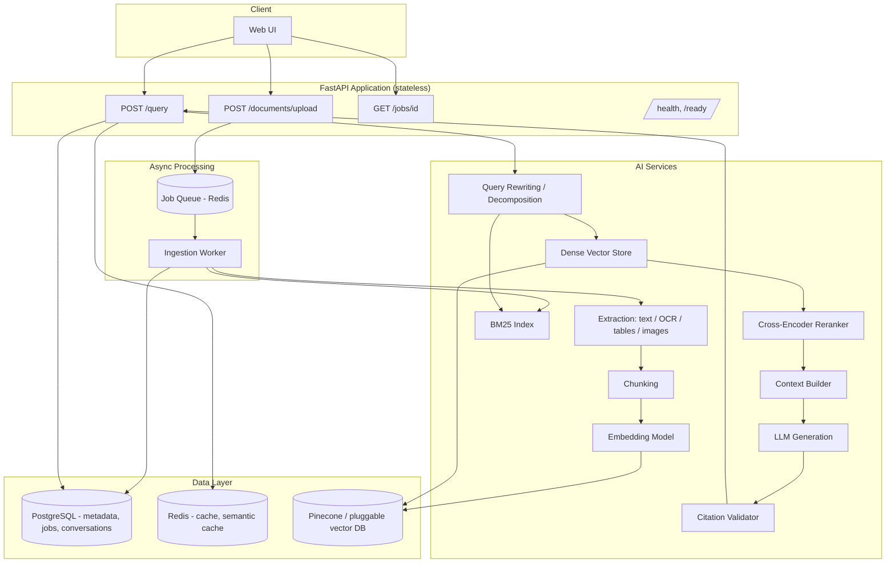
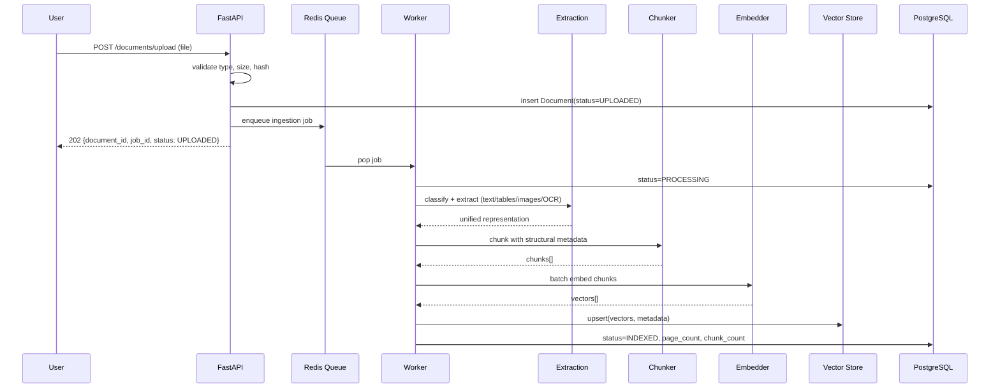
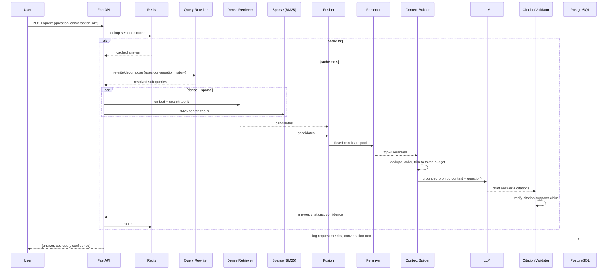
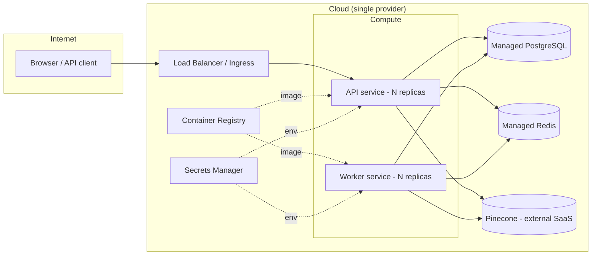

# Architecture — Multimodal RAG Platform

## 1. Requirements

### 1.1 Functional Requirements

| ID | Requirement |
|----|-------------|
| FR-1 | Users can upload PDF, DOCX, TXT, Markdown, HTML, and image documents. |
| FR-2 | The system classifies document type and extracts text, tables, and images. |
| FR-3 | Scanned/image documents are processed with OCR. |
| FR-4 | Documents are chunked using a configurable strategy that preserves structural metadata. |
| FR-5 | Chunks are embedded with a configurable embedding model and stored in a vector index. |
| FR-6 | Users can query the corpus in natural language and receive a grounded answer with citations. |
| FR-7 | Retrieval combines dense (embedding) and sparse (BM25) search, fused and reranked. |
| FR-8 | The system distinguishes supported claims from unsupported ones and abstains when evidence is insufficient. |
| FR-9 | Users can hold a multi-turn conversation; follow-up questions resolve against prior turns. |
| FR-10 | All retrieval and generation quality is measurable via an evaluation harness with a fixed dataset. |
| FR-11 | Document processing runs asynchronously; clients can poll job status. |
| FR-12 | The system exposes `/health` and `/ready` endpoints and Prometheus-style metrics. |

### 1.2 Non-Functional Requirements

| ID | Requirement |
|----|-------------|
| NFR-1 | p95 end-to-end query latency is measured and reported; regressions must be caught by benchmark tests. |
| NFR-2 | The vector store is accessed through an abstraction; swapping providers requires no changes above the repository layer. |
| NFR-3 | All secrets are supplied via environment variables; nothing sensitive is committed to source control. |
| NFR-4 | The system is horizontally scalable: API is stateless, ingestion runs on a separate worker pool. |
| NFR-5 | Every component that materially affects answer quality must have a baseline and a measured comparison before/after. |
| NFR-6 | The system must fail gracefully — corrupted files, empty documents, LLM timeouts, and vector-store outages must not crash the API. |
| NFR-7 | The full stack must start with a single `docker compose up`. |
| NFR-8 | CI must run lint, type-check, unit/integration/API tests, and a Docker build on every PR. |

## 2. System Architecture

## 3. Data Flow (Ingestion)

## 4. Data Flow (Query / Retrieval)

## 5. Deployment Architecture

## 6. Repository Layout

See root `README.md` and the tree under this repo. Key boundary: `app/api` (HTTP only) →
`app/services/*` (business/AI logic) → `app/repositories` (DB/vector-store access). Route
handlers never touch the database or vector store directly.

## 7. Vector Store Abstraction

`app/services/retrieval/vector_store.py` defines a `VectorStore` protocol
(`upsert`, `query`, `delete`, `delete_by_document`). Two implementations ship in Phase 1:

- `PineconeVectorStore` — production backend, selected when `VECTOR_STORE=pinecone` and
  `PINECONE_API_KEY` is set.
- `LocalVectorStore` — in-process cosine-similarity index persisted to disk as
  `.npz` + JSON sidecar metadata. Selected when `VECTOR_STORE=local` (the default for
  local dev and CI, since it requires no external account).

Both satisfy the same interface, so retrieval/reranking/generation code never branches
on backend.

## 8. Evaluation Strategy (summary — see `docs/evaluation.md`)

A versioned dataset under `evaluation/datasets/` drives all quality claims. Retrieval
metrics (Recall@K, Precision@K, MRR, nDCG) are computed against `expected_chunks`.
Generation metrics (faithfulness, citation correctness) combine a deterministic citation
checker with an LLM-as-judge pass, and both are labeled as such in reports — nothing is
reported as a "score" without stating how it was computed.

## 9. Deployment Strategy (summary — see `docs/deployment.md`)

Phase 1–20 target `docker compose up` for local/dev. Phase 24 adds a real cloud target
(documented, not assumed) — this repository will clearly mark whether a given README
claim reflects local-only or actually-deployed infrastructure.
